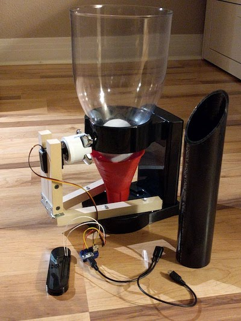
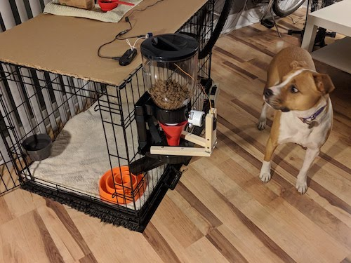
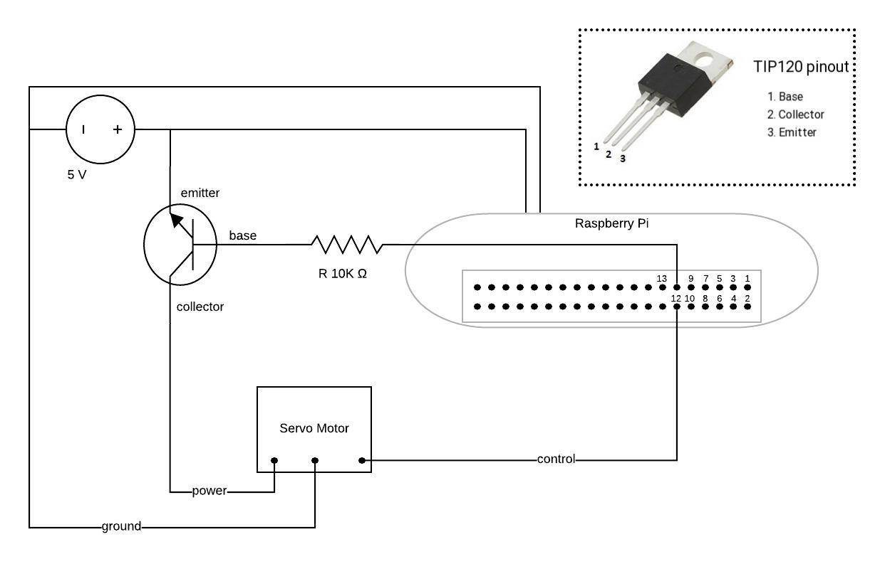

# Dog Feeder

## Overview

The purpose of this project was to find a way to feed my dog on a regular cadence, as well as verify 
that she had been fed.  This involved the use of a Raspberry Pi, a Servo Motor, a camera, 
and some creative assembly of wood, PVC pipe, and a breakfast cereal dispenser.

The servo motor was attached to the rotating part of the cereal dispenser in the place of the 
handle that would be normally used by a human to manually dispense food.  When my program ran, 
it would cause the servo to rotate, which would cause the dispenser to rotate, 
thus dispensing food for the dog.  The food would then travel down a PVC pipe and into the dog's bowl 
for consumption.

The code that handled the servo operation was invoked by a cron job on the Rasbperry Pi, 
which was scheduled 4x a day, so that my dog would be fed equal servings at each meal.

The first iteration of the dog feeder can be seen in action [here](https://youtu.be/5L-E-7JgWd4).  
Below are two still photos of all the components, and the assembled final version.

Because of the possibility of power outages and other issues, which would have impacted 
the dog's feeding, that I was unable to know about without SSH-ing to the Raspberry Pi and looking 
at the logs.  So, in addition to making modifications to the PVC to increase accuracy of the delivery 
of the payload, I also added on a process that would take a picture of the food in the bowl 
immediately after it was delivered, and then email that picture to me, so I could know how 
well she was fed (or not fed).

## Code

The code for this project can be located in the [dog-feeder](dog-feeder/) directory.

`crontab.txt` shows the relevant invocation parameters, as well as starting the necessary 
daemons to ensure proper operation of the dog feeder from the Rasbperry Pi.  
As you can see in `crontab.txt`, the process was invoked by a shell script `feedDog.sh`.  
This shell script then invokes the `feed-dog.py` script, which handles all the logic around 
operating the servo, taking a photo after the food has been dispensed, and emailing the result to me.

The [dog-feeder/test-scripts](dog-feeder/test-scripts) directory contains "scratch code" 
that was used to test various options for connecting to the servo, or the camera, etc.  
This represents iterative testing that ultimately resulted in the final product described above.

## Circuit Diagram

Supplies:
* D645MW Digital Super Torque servo from HiTec
* TIP120 transistor
* 10,000 Ohm resistor
* USB Micro power adapter (5V) for a breadboard
* Y-Power Adapter (to power the Raspberry Pi and the Servo separately from the same outlet)
* small breadboard

## History
This repository is a fork of [Kate's](https://github.com/kmfrett)
[home-projects](https://github.com/kmfrett/home-projects) repo at a time when it only contained the 
dog-feeder project.
Kate and I collaborated on the construction and coding of this feeder.